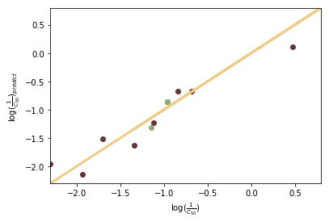
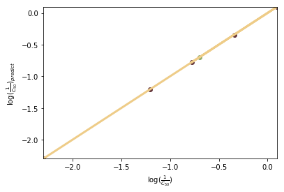
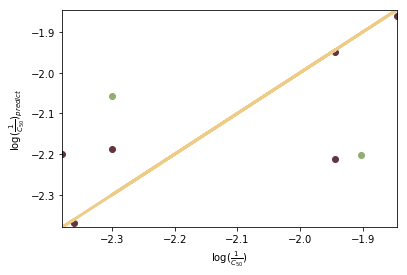

```python
import matplotlib.pyplot as plt
import numpy as np
from sklearn import linear_model
import scipy.io as scio
from sklearn.metrics import mean_squared_error, r2_score
import random
```


```python
def regression(n,m):
    data = scio.loadmat(str(n)+"-substituted.mat")
    reg = linear_model.LinearRegression()
    X=data['X']
    X_o=data['X']
    y=data['y']
    y_o=data['y']
    seed1=random.randint(0,len(y)-1)
    seed2=random.randint(0,len(y)-1)
    X=np.delete(X,seed1,0)
    y=np.delete(y,seed1,0)
    X=np.delete(X,seed2,0)
    y=np.delete(y,seed2,0)
    #reg.fit(X,y)
    #X=np.delete(a,m,axis=0)
    #y=np.delete(b,m,axis=0)
    reg.fit(X,y)
    y_pred0= reg.predict(X)
    y_pred = reg.predict([X_o[seed1],X_o[seed2]])
    
    #y_pred_o=np.delete(y_pred,m,axis=0)
    
    #LinearRegression(copy_X=True, fit_intercept=True,n_jobs=None,normalize=False)
    # The coefficients
    print('Coefficients: \n', reg.coef_)
    #intercept
    print('Intercept: \n', reg.intercept_)
    # The mean squared error
    print("Mean squared error: %.2f"% mean_squared_error(y,y_pred0))
    # Explained variance score: 1 is perfect prediction
    print('Variance score: %.2f' % r2_score(y,y_pred0))
    # Plot outputs
    plt.xlim(min(y),max(y))
    plt.ylim(min(y),max(y))
    plt.scatter(y,y_pred0,  color='#64363C')
    plt.scatter([y_o[seed1],y_o[seed2]],y_pred,  color='#91AD70')
    plt.plot(y,y, color='#EECC88', linewidth=3)
    plt.xlabel(r'$\log(\frac{1}{C_{50}})$')
    plt.ylabel(r'$\log(\frac{1}{C_{50}})_{predict}$')
    return seed1+1,seed2+1,[y_o[seed1],y_o[seed2]],y_pred
```


```python
n=input("input regression molecule number(2~4): ")
#regression(n,5)
print(regression(n,5))
```

    input regression molecule number(2~4): 3
    Coefficients: 
     [[ 0.22076964  0.40987645 -0.71932455  0.06224282]]
    Intercept: 
     [-2.01989456]
    Mean squared error: 0.05
    Variance score: 0.94
    (6, 11, [array([-1.14612804]), array([-0.96378783])], array([[-1.31910576],
           [-0.8537973 ]]))
    





```python
n=input("input regression molecule number(2~4): ")
#regression(n,5)
print(regression(n,5))
```

    input regression molecule number(2~4): 2
    Coefficients: 
     [[ 0.63873489 -0.51021355  3.42377692  0.07512225]]
    Intercept: 
     [-2.37840591]
    Mean squared error: 0.00
    Variance score: 1.00
    (7, 3, [array([0.16115091]), array([-0.69897])], array([[-0.85533952],
           [-0.69888666]]))
    





```python
n=input("input regression molecule number(2~4): ")
#regression(n,5)
print(regression(n,5))
```

    input regression molecule number(2~4): 4
    Coefficients: 
     [[-0.42145708  0.70352722 -1.18284299  0.00183589]]
    Intercept: 
     [-2.05970621]
    Mean squared error: 0.02
    Variance score: 0.60
    (7, 1, [array([-1.90308999]), array([-2.30103])], array([[-2.20143807],
           [-2.05781525]]))
    




